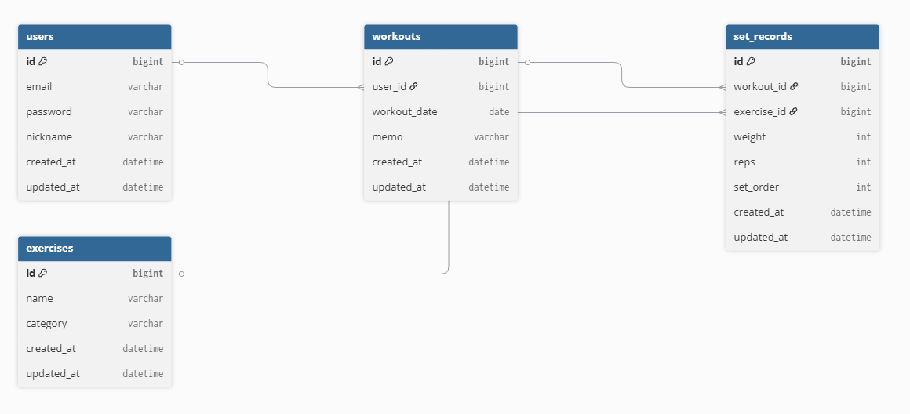

# 🏋️ Fitness Workout API

JWT 기반 인증을 사용한 운동 기록 관리 백엔드 API입니다.

회원가입·로그인 후, 인증된 사용자만 자신의 운동 기록을 저장/조회할 수 있도록 설계했습니다.

### 📌 프로젝트 목적

- 단순 CRUD를 넘어 인증·인가 흐름을 직접 구현

- Spring Security + JWT 구조 이해 및 실습

- 도메인 중심 패키지 구조를 적용한 백엔드 설계 경험

### 🔐 인증 구조 (JWT) 

**로그인 흐름**

1. 이메일/비밀번호로 로그인

2. 로그인 성공 시 JWT Access Token 발급

3. 이후 요청 시 Authorization: Bearer <token> 헤더 사용

4. JwtFilter에서 토큰 검증 후 SecurityContext에 인증 정보 저장

**인증 객체**

- UserPrincipal을 통해 인증 사용자 정보 관리

- 컨트롤러에서 @AuthenticationPrincipal로 사용자 정보 접근

### 📊 ERD (개념)

- User : 회원 정보

- Workout : 하루 운동 기록

- SetRecord : 운동 세트 기록

- Exercise : 운동 종목

**관계:**

- User 1 : N Workout

- Workout 1 : N SetRecord

- SetRecord N : 1 Exercise

