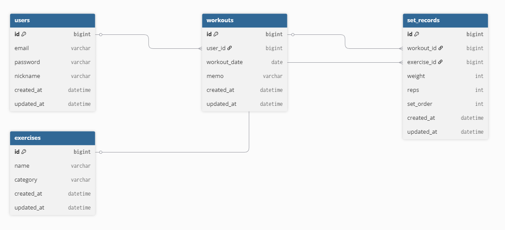

# 🏋️‍♂️ Fitness Tracker Backend

JWT 인증 기반 개인 운동 기록 및 통계 관리 백엔드 서비스입니다.  
운동 기록 CRUD, 주간 통계, 종목별 PR, 대시보드 기능을 제공합니다.

## 📌 프로젝트 목적

- 단순 CRUD를 넘어 인증·인가 흐름을 직접 구현

- Spring Security + JWT 구조 이해 및 실습

- 도메인 중심 패키지 구조를 적용한 백엔드 설계 경험

## Tech Stack

- Language: Java 17
- Framework: Spring Boot 3.5.9
- Security: Spring Security + JWT
- ORM: JPA (Hibernate)
- Database: MySQL (Docker)
- Build Tool: Gradle
- API Test: Postman
- Version Control: Git / GitHub

## 🔐 인증 구조 (JWT) 

**로그인 흐름**

1. 이메일/비밀번호로 로그인

2. 로그인 성공 시 JWT Access Token 발급

3. 이후 요청 시 Authorization: Bearer <token> 헤더 사용

4. JwtFilter에서 토큰 검증 후 SecurityContext에 인증 정보 저장

**인증 객체**

- UserPrincipal을 통해 인증 사용자 정보 관리

- 컨트롤러에서 @AuthenticationPrincipal로 사용자 정보 접근

## 📊 ERD (개념)

- User : 회원 정보

- Workout : 하루 운동 기록

- SetRecord : 운동 세트 기록

- Exercise : 운동 종목

**관계:**

- User 1 : N Workout

- Workout 1 : N SetRecord

- SetRecord N : 1 Exercise

## 🔧API Endpoints

### Authentication
| Method | URL | Description |
|--------|------|-------------|
| POST | /api/auth/login | 로그인 |

### Workout
| Method | URL | Description |
|--------|------|-------------|
| POST | /api/workouts | 운동 기록 생성 |
| GET | /api/workouts?date= | 날짜별 조회 |
| GET | /api/workouts/{id} | 상세 조회 |
| PATCH | /api/workouts/{id}/memo | 메모 수정 |
| DELETE | /api/workouts/{id} | 삭제 |

### Set
| Method | URL | Description |
|--------|------|-------------|
| POST | /api/workouts/{id}/sets | 세트 추가 |
| PATCH | /api/workouts/{id}/sets/{setId} | 세트 수정 |
| DELETE | /api/workouts/{id}/sets/{setId} | 세트 삭제 |

### Statistics
| Method | URL | Description |
|--------|------|-------------|
| GET | /api/stats/weekly | 주간 통계 |
| GET | /api/stats/prs | 종목별 PR |
| GET | /api/dashboard | 대시보드 |
